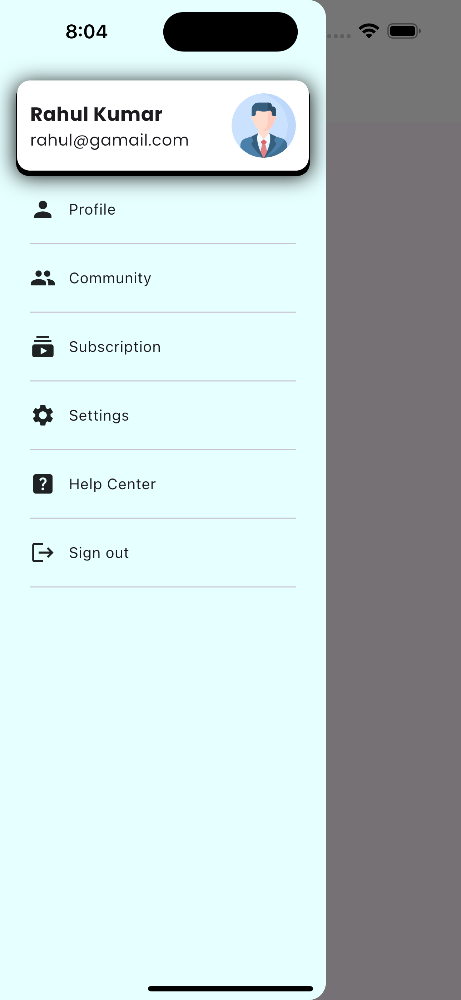

## 📱 Drawer UI with Simple Look

**This project showcases a modern and clean custom drawer user interface built using Flutter. 
The design focuses on simplicity, smooth layout, and visually appealing elements like shadows and spacing.**

🎯  Features

•	🔹 User Profile Card

    •	Displays user name and email
    •	Circular avatar with fallback icon
    •	Elevated card design with shadow effect

•	🔹 Clean Navigation Menu

	•	Profile
	•	Community
	•	Subscription
	•	Settings
	•	Help Center
	•	Sign Out

•	🔹 Icon + Text Layout

	•	Each menu item uses a consistent icon and label structure
	•	Proper spacing and alignment for better readability

•	🔹 Divider Lines

	•	Subtle separators between menu items
	•	Improves UI clarity and structure

•	🔹 Responsive Layout

	•	Works well on different screen sizes
	•	Uses flexible widgets like Row, Column, and Spacer

🧠 Concepts Used

    •	Flutter Layout System (Row, Column, Spacer)
    •	CircleAvatar for profile image
    •	Container with BoxDecoration (shadow & border radius)
    •	Icons for UI elements
    •	Padding and SizedBox for spacing
    •  	Clean UI structuring and alignment techniques

🎨 UI Highlights
    
    •	Minimal and modern design
    •	Smooth spacing and alignment
    •	Soft shadow effect for depth
    •	Professional drawer layout similar to real-world apps

📸 Screenshot
    

## This project helped in understanding how to build a structured and visually appealing drawer UI in Flutter. ##
## It strengthens knowledge of layout design, spacing, and reusable UI components. ##